# Hi 👋, ich bin Adrian

C++ Softwareentwickler aus Berlin mit Schwerpunkt auf Desktop-Anwendungen mit Qt.  
Neben C++ arbeite ich auch gelegentlich mit anderen Technologien und Projekten.

🔗 LinkedIn: https://www.linkedin.com/in/adrian-helbig

## 🛠 Technologien

<table>
  <tr>
    <td width="48%" valign="top">
      <b>🚀 Core</b> 
      C++ • Qt
    </td>
    <td width="4%"></td>
    <td width="48%" valign="top">
      <b>⚙️ Toolchain & Build</b> 
      MSVC • CMake
    </td>
  </tr>
  <tr>
    <td valign="top">
      <b>🧪 Testing & Documentation</b> 
      GoogleTest • Doxygen
    </td>
    <td></td>
    <td valign="top">
      <b>💻 Development Tools</b> 
      Visual Studio • VS Code • Git • GitHub Copilot • Docker
    </td>
  </tr>
  <tr>
    <td valign="top">
      <b>🌐 Web & Scripting</b> (nebensächlich) 
      JavaScript • Node.js • HTML5 • CSS3
    </td>
    <td></td>
    <td valign="top">
      <b>🎓 Uni (Basics)</b> 
      C • Java • Erlang • Prolog • LabView (G)
    </td>
  </tr>
</table>

## 📂 Projekte

<table>
  <tr>
    <td width="48%" valign="top">
      <b>📦 Libraries & Apps</b> 
      <a href="https://github.com/Dingola/Qt-LogViewer">Qt-LogViewer</a> • 
      <a href="https://github.com/Dingola/QtWidgetsCommonLib">QtWidgetsCommonLib</a> • 
      <a href="https://github.com/Dingola/SimpleQtLogger">SimpleQtLogger</a> • 
      <a href="https://github.com/Dingola/SimpleCppLogger">SimpleCppLogger</a> • 
      <a href="https://github.com/Dingola/CommonLib">CommonLib</a> • 
      <a href="https://github.com/Dingola/PortfolioWebApp">PortfolioWebApp</a>
    </td>
    <td width="4%"></td>
    <td width="48%" valign="top">
      <b>📋 Templates</b> 
      <a href="https://github.com/Dingola/QtWidgetsTemplate">QtWidgetsTemplate</a> • 
      <a href="https://github.com/Dingola/QtQuickTemplate">QtQuickTemplate</a> • 
      <a href="https://github.com/Dingola/CppTemplate">CppTemplate</a>
    </td>
  </tr>
</table>

## 📊 GitHub
*(Hinweis: Die linke Statistik beinhaltet nur Daten aus öffentlichen Repositories.)*

  
  

